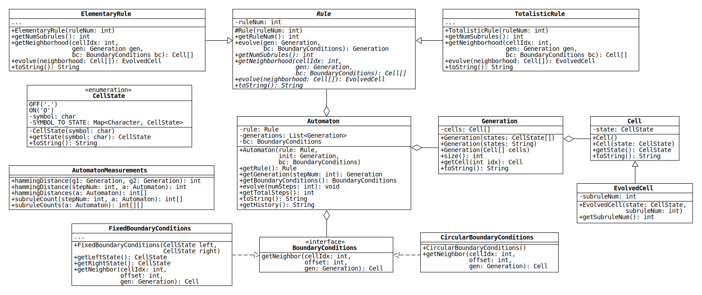

# Project 2: Not-So-Elementary Cellular Automata

> The key to maximizing reuse lies in anticipating new requirements and changes to existing requirements...
> To design a system so that it's robust to such changes, you must consider how the system might need to change over its lifetime.
> A design that doesn't take change into account risks major redesign in the future.
>
> &mdash;Gang of Four, in [*Design Patterns: Elements of Reusable Object-Oriented Software*](https://en.wikipedia.org/wiki/Design_Patterns)

## Introduction

In Project 1 we wrote a program to simulate [elementary cellular automata](https://en.wikipedia.org/wiki/Elementary_cellular_automaton) (ECA).
Recall that a cellular automaton is considered "elementary" if it has the following characteristics:

1. Each cell can be in only one of two states.
2. The cells are arranged in a line.
3. The rule that determines the next state of each cell depends on only the cell's current state and the states of its two nearest neighbors.

Although ECA are defined mathematically as having an infinite number of cells, our program simulated their evolution on a finite grid and used circular boundary conditions to get the neighbors of the leftmost and rightmost cells.

In this project, we will refactor and extend our program using a modular design.
We will continue to limit ourselves to one-dimensional grids of two-state cells, but the resulting program will be able to simulate multiple types of rules and boundary conditions.
The new design will also allow us to add more rules and boundary conditions in the future without changing the existing code.

In addition to redesigning the program, we will write a small utility class that calculates various measures of how an automaton evolves.
This class will be used to compare automata in a future project.

## Class Diagram

Below is a UML class diagram for Project 2.
Please see the PDF copy when writing your code, since the SVG image shown in GitHub is small and does not display the correct indentation for method signatures that extend over multiple lines.



The src folder of this repository contains the code for the interface BoundaryConditions and two custom exception classes, which are not shown in the diagram.
Your task is to write the remaining classes.

Note that the diagram shows only public methods.
You may add as many private methods as you need to make the classes work as described in this document, but don't change the public method signatures.
(These are the methods that will be called to test your code.)

The diagram shows a handful of private fields, but most of the fields needed to implement the classes are not shown.
If an ellipsis appears in the middle compartment of a class box, this indicates that you will probably need to add fields.

## A Note on Design

Notice that the Automaton class stores references of the abstract types Rule and BoundaryCondition.
This implies that an Automaton can use objects of any rule class that extends Rule and any boundary condition class that implements BoundaryConditions.
We could write a class that simulates an entirely new type of rule, and as long as it is a subclass of Rule, it will be compatible with Automaton.

To take advantage of this modular design, the Automaton constructor does not instantiate Rule or BoundaryConditions objects.
Instead, the objects it uses are constructed ahead of time (e.g., in the main method) and passed to the constructor.
This technique is called "[dependency injection](https://en.wikipedia.org/wiki/Dependency_injection)."

Dependency injection makes instantiating an Automaton a bit tedious, but it will allow us to reuse the class in the future, with rules and boundary conditions we haven't even written yet, [without modifying the code](https://en.wikipedia.org/wiki/Open%E2%80%93closed_principle).

## CellState

Cell states in Project 1 were represented by boolean values.
In this project, the states are represented by the enumerated type CellState, which has two values: OFF and ON.
This approach has a few advantages:

1. The names of the values, "CellState.OFF" and "CellState.ON," are more meaningful than "false" and "true," which makes the code more readable.
2. If we want the cells to have more than two states in the future, it is straightforward to add additional CellState values.
3. Since Java enums are fully-fledged classes, we can add fields that associate each CellState with a unique symbol, which represents the state when printed to the console.

Below are descriptions of some of the CellState members.

* `char symbol`: An instance variable that stores the symbol associated with each CellState.

* `Map<Character, CellState> SYMBOL_TO_STATE`: A static Map from each symbol to the associated CellState.
(Refer to Lab 8 for details on how to initialize a static Map.)

* `CellState getState(char symbol)`: A static method that returns the CellState associated with a given symbol.
(Use the Map SYMBOL_TO_STATE to get the CellState.)
This method is used by one of the Generation constructors.

* `String toString()`: Return the symbol that represents the CellState value.

## Cell

This class represents a single cell in an automaton.
It has only one field, which stores the cell state.
Its toString method returns the symbol that represents this state.

In Project 1, many people chose not to use the Cell class, finding it redundant to wrap the cell state in a class with no other fields.
If you are one of these people, you may be wondering why we don't simply represent each cell with a CellState value.

The reason is that, in this project, we are going to track the subrule applied to each cell when an automaton evolves, and an easy way to do this is to extend the Cell class.
If cells were represented by CellStates, inheritance would not be an option, since enumerated types cannot be extended in Java.

Note that an alternative approach would be to add a field directly to the Cell class.
In every automaton, however, there is one generation that is not produced by applying a rule: the initial generation.
What value should we assign to this new field in the initial cells?
Rather than answer this question, we can simply use regular Cells to represent the initial generation and EvolvedCells (see below) to represent future generations.

## EvolvedCell

This class represents a single cell in an automaton produced by an earlier generation of cells.
In addition to the cell state, the class stores the number of the subrule used to produce the cell.
(The subrule number is defined in the ElementaryRule section below.)

## Generation

This class represents all of the cells in an automaton at a single moment in time.
Each Generation stores an array of Cells.

As with the Cell class, many people decided not to use the Generation class in Project 1.
Instead, these people used an unencapsulated array of Cells or boolean values.

There are a couple of reasons why it makes sense to wrap the array in a class:

1. A generation is a snapshot of an automaton.
Generations don't change; rather, when an automaton evolves, a new generation is created.
To reflect this in our program, Generation objects should be immutable.
This cannot be accomplished with an unencapsulated array.
2. Constructors can be written to conveniently create Generations from different inputs (e.g., CellStates and Strings).

Below are descriptions of some of the Generation members.

* `Cell[] cells`: A reference to an array of Cells.
If the Generation is the initial state of an Automaton, the array will store regular Cell objects.
If the Generation was produced by the evolution of another Generation, the array will store EvolvedCell objects.

* `Generation(CellState[] states)`: Construct a Generation of regular Cell objects from an array of CellStates.
The number of Cells is equal to the length of the array, and the Cells have the same states in the same order.

* `Generation(String states)`: Construct a Generation of regular Cell objects from a String of characters representing cell states.
If any symbol is not a key in the Map SYMBOL_TO_STATE (in the CellState enum), throw an IllegalArgumentException.

* `Generation(Cell[] cells)`: Construct a Generation from an array of Cells.
Make a copy of the array to ensure the Generation is immutable.
Note that this is the only way to create a Generation of EvolvedCell objects.

* `String toString()`: Return a string representation of the Generation.
The String consists of the concatenation of the characters that represent the states of the Cells.
(Hint: Use the toString method of the Cell class.)

## Rule

This abstract class represents a cellular automaton rule that governs how cell states change.
Any concrete subclass (i.e., a class that extends Rule and implements its abstract methods) can be used with the Automaton class.
We will write two such classes: ElementaryRule and TotalisticRule (see below).

The behavior of a rule is defined by implementing the following two abstract methods:

* `Cell[] getNeighborhood(int cellIdx, Generation gen, BoundaryConditions bc)`: Return the neighborhood of the cell with index cellIdx subject to the given boundary conditions.
The neighborhood of a cell consists of the cells that determine its state in the next generation.
For a one-dimensional automaton, the neighborhood is typically the cell itself and the two adjacent cells.

* `EvolvedCell evolve(Cell[] neighborhood)`: Apply the rule to a cell with the given neighborhood.
The method returns a new EvolvedCell that represents the cell in the next generation.

Concrete Rule subclasses must also implement two methods that return information about the rule:

* `int getNumSubrules()`: Return the number of subrules used to determine the next state of a cell from its neighborhood (i.e., the length of the rule table).

* `String toString()`: Return a string representation of the rule.

Finally, Rule has a couple of non-abstract methods:

* `int getRuleNum()`: Return the number that specifies a particular instance of the rule.

* `Generation evolve(Generation gen, BoundaryConditions bc)`: Apply the rule to a given Generation, subject to the given boundary conditions, to calculate the next Generation.
(Hint: Use the abstract methods described above.)

## ElementaryRule

This class represents a rule that governs the evolution of an elementary cellular automaton.

Recall from Project 1 that an elementary rule defines the neighborhood of a cell as the cell to its left, the cell itself, and the cell to its right.
Since each of these cells can be in two states, there are 8 possible neighborhood configurations.

An elementary rule maps each neighborhood configuration to a cell state, which is the state of the center cell in the next generation.
Since there are 8 configurations, and each configuration can be mapped to two states, there are 256 possible elementary rules (2 to the power of 8).

Elementary rules are often depicted graphically with a table.
For example, below is the table for [Rule&nbsp;110](https://en.wikipedia.org/wiki/Rule_110):

|⬛⬛⬛|⬛⬛⬜|⬛⬜⬛|⬛⬜⬜|⬜⬛⬛|⬜⬛⬜|⬜⬜⬛|⬜⬜⬜|
|:-:|:-:|:-:|:-:|:-:|:-:|:-:|:-:|
| ⬜ | ⬛ | ⬛ | ⬜ | ⬛ | ⬛ | ⬛ | ⬜ |

The symbols ⬜ and ⬛ represent cells in the OFF and ON states respectively.
The top row shows each of the 8 neighborhood configurations.
The bottom row shows the state of the center cell in the next generation.

Each elementary rule is assigned a unique number between 0 and 255 using the [Wolfram code](https://en.wikipedia.org/wiki/Wolfram_code).
To find the rule number, replace ⬜ and ⬛ with 0 and 1 in the bottom row of the table and interpret the result as a binary number.
For the table above, the binary number is 01101110, which is equal to 110 in base 10 (0 + 64 + 32 + 0 + 8 + 4 + 2 + 0).

Notice that the neighborhood configurations in the top row are ordered using an analogous numbering scheme.
If ⬜ and ⬛ are replaced with 0 and 1, the top row looks like this:
|111|110|101|100|011|010|001|000|
|:-:|:-:|:-:|:-:|:-:|:-:|:-:|:-:|

If each bit string is interpreted as a binary number and converted to base 10, the row looks like this:
|7|6|5|4|3|2|1|0|
|:-:|:-:|:-:|:-:|:-:|:-:|:-:|:-:|

Call these the "subrule numbers."

Each elementary rule consists of 8 subrules, one for each neighborhood configuration.
The subrules are the columns of the rule table.
For example, here is subrule 5 of Rule 110:
|⬛⬜⬛|
|:-:|
| ⬛ |

Below is some additional information about the class methods.

* `ElementaryRule(int ruleNum)`: If the given integer is not a valid rule number, throw an InvalidRuleNumException.

* `String toString()`: Return a two-line string representation of the rule table, using the characters that represent CellState.OFF and CellState.ON.
Separate each neighborhood configuration with a single space, and align the characters on the second line with the center character of each configuration.
For example, below is the representation of Rule 110 printed to the console:

  ```
  OOO OO. O.O O.. .OO .O. ..O ...
   .   O   O   .   O   O   O   . 
  ```

  Note that the second line includes a trailing space to make it the same length as the first.

## TotalisticRule

This class represents a rule that governs the evolution of a two-state [totalistic cellular automaton](https://mathworld.wolfram.com/TotalisticCellularAutomaton.html) with a neighborhood radius of 2.

Like an elementary rule, a totalistic rule determines the state of each cell in the next generation by looking at its current state and the states of its neighbors.
Unlike an elementary rule, a totalistic rule does not care about the configuration of the neighborhood, only the *total* number of cells in the ON state.
Totalistic rules map each neighborhood total to a cell state, which is the state of the center cell in the next generation.

To make these rules a bit more interesting, we will use a neighborhood radius of 2.
This means that the neighborhood of each cell consists of 5 cells: the 2 nearest neighbors on its left, the cell itself, and the 2 nearest neighbors on its right.
Since each of these cells can be either ON or OFF, the neighborhood total (i.e., the total number of ON cells) is an integer between 0 and 5.

Totalistic rules can be depicted graphically with a table.
For example, below is the table for totalistic rule 22:
| 5 | 4 | 3 | 2 | 1 | 0 |
|:-:|:-:|:-:|:-:|:-:|:-:|
| ⬜ | ⬛ | ⬜ | ⬛ | ⬛ | ⬜ |

The top row shows each of the 6 neighborhood totals.
The bottom row shows the states of cells with the corresponding neighborhood totals in the next generation.
For instance, if the neighborhood of a cell has 3 cells in the ON state, the state of the cell in the next generation will be OFF (⬜).
Since there are 6 possible totals, and each total can be mapped to one of 2 states, there are 64 possible totalistic rules (2 to the power of 6).

The totalistic rules can be numbered analogously to the elementary rules: replace ⬜ and ⬛ with 0 and 1 in the bottom row of the table and interpret the result as a binary number.
For the table above, the binary number is 010110, which is equal to 22 in base 10 (0 + 16 + 0 + 4 + 2 + 0).

Each totalistic rule consists of 6 subrules, one for each neighborhood total.
We will number the subrules using the total.
For example, here is subrule 4 of totalistic rule 22:
| 4 |
|:-:|
| ⬛ |

To illustrate how the behavior of a totalistic rule differs from an elementary rule, consider the following example, which applies totalistic rule 22 to an initial generation of cells using circular boundary conditions:

```
⬜⬜⬜⬛⬛⬛⬛⬛⬜⬜⬜
⬜⬛⬛⬜⬛⬜⬛⬜⬛⬛⬜
```

The initial generation is shown on the first line, and the next generation is shown on the second.
The leftmost cell remains OFF because its neighborhood total is 0.
(Note that its left neighbors are the last two cells on the top line.)
The second-from-the-left cell (i.e., the cell with index 1) turns on because its neighborhood, which consists of the first four cells plus the last cell, has 1 cell in the ON state (the cell with index 3).

Below is some additional information about the class methods.

* `TotalisticRule(int ruleNum)`: If the given integer is not a valid rule number, throw an InvalidRuleNumException.

* `String toString()`: Return a string representation of the rule table.
For example, the String returned for rule 22 is `"5 4 3 2 1 0\n. O . O O ."`, which appears like this when printed to the console:
  
  ```
  5 4 3 2 1 0
  . O . O O .
  ```

## BoundaryConditions

In Project 1 we used circular boundary conditions to find the neighbors of the first and last cells in a generation.
In this project, the boundary conditions will be defined by a class that implements the BoundaryConditions interface.
Any class that implements this interface can be used with the Automaton class.
We will write two such classes: CircularBoundaryConditions and FixedBoundaryConditions.

The BoundaryConditions interface has a single method with the following signature:

```java
Cell getNeighbor(int cellIdx, int offset, Generation gen)
```

This method returns the neighbor of a cell in a given generation.
The cell is specified by its index, and its neighbor is specified by an offset.
The index of the neighbor is the sum of the cell index and the offset.

For instance, consider the generation shown in the following table, where the numbers in the bottom row are the cell indices:
|⬜|⬛|⬛|⬜|
|:-:|:-:|:-:|:-:|
|0|1|2|3|

For this generation, the method call `getNeighbor(2, 1, gen)` returns a reference to the cell with index 3.
The method call `getNeighbor(2, -2, gen)` returns a reference to the cell with index 0.
As long as the sum of the cell index and offset are equal to a valid cell index (in this case 0, 1, 2, or 3), any implementation of the method should return a reference to the corresponding cell.

Implementations of the method differ in how they handle invalid neighbor indices.
This behavior is what defines the boundary conditions.

## CircularBoundaryConditions

This class treats the cells of an automaton as though they are arranged in a circle.
It implements getNeighbor so that invalid neighbor indices wrap back into the valid range using modular arithmetic.

Suppose, for example, that an automaton has 10 cells, which are indexed from 0 to 9.
Calling `getNeighbor(0, -1, gen)` on a Generation returns a reference to the Cell with index 9.
Calling `getNeighbor(8, 2, gen)` returns a reference to the Cell with index 0.

In the first example, the neighbor has index -1, which wraps around the left boundary to index 9.
In the second, the neighbor has index 10, which wraps around the right boundary to index 0.

## FixedBoundaryConditions

This class treats an automaton as though it has an infinite number of cells extending to the left and right.
All of the cells with indices less than 0 are fixed in the same state.
Call these the "left boundary cells."
All of the cells with indices greater than or equal to the size of the automaton are fixed in another state.
Call these the "right boundary cells."

The states of the boundary cells are specified by the constructor parameters left and right.
Since each parameter has two values, there are 4 possible fixed boundary conditions.
For instance, `FixedBoundaryConditions(CellState.OFF, CellState.ON)` specifies that the left boundary cells are all OFF, and the right boundary cells are all ON.

Suppose that an automaton has 10 cells and the boundary cells are in the states described above.
Calling `getNeighbor(0, -2, gen)` returns a reference to a Cell in the OFF state, since the neighbor index (-2) is less than 0.
Calling `getNeighbor(8, 5, gen)` returns a reference to a Cell in the ON state, since the neighbor index (13) is greater than or equal to 10.

## Automaton

This class represents a one-dimensional cellular automaton with cells that can be in two states.
The rule that governs the evolution of the cells can be any concrete subclass of Rule, and the boundary conditions can be any class that implements BoundaryConditions.

Below are descriptions of some of the methods.

* `void evolve(int numSteps)`: Evolve the Automaton a given number of steps, appending each successive Generation to the generations List.
If the number of steps is less than or equal to 0, leave the Automaton unchanged.
(Hint: Use the evolve method of the Rule class.)

* `int getTotalSteps()`: Return the total number of steps that the Automaton has evolved.

* `Generation getGeneration(int stepNum)`: Return the Generation produced by the given evolution step.
If the Automaton has not evolved this far, first call the evolve method with the necessary number of steps.

  Let the steps be numbered starting from 0.
  The initial generation corresponds to step 0.
  The first evolved generation is produced by step 1, and so on.
  If a negative step number is given, throw an InvalidStepNumException.

* `String toString()`: Return a String representation of the current generation.

* `String getHistory()`: Return a String that represents the entire evolution of the Automaton.
The String consists of the representations of all the Generations joined together by newline characters.
(Note: This was the toString method in Project 1.)

## AutomatonMeasurements

This is a utility class used to calculate quantities that characterize how an automaton evolves.
Below are descriptions of the methods.

* `int hammingDistance(Generation g1, Generation g2)`: Calculate the Hamming distance between two generations.
(The Hamming distance is the number of cell states that must be flipped to make the generations the same.)
If the sizes of the generations are different, throw an IllegalArgumentException.

* `int hammingDistance(int stepNum, Automaton a)`: Calculate the Hamming distance between two successive generations (i.e., the states of the Automaton immediately before and after the given evolution step).
The step number must be greater than 0.

* `int[] hammingDistances(Automaton a)`: Calculate the Hamming distance for each pair of successive generations.
The length of the returned array is equal to the total number of steps, and the distances are sorted by step number.

* `int[] subruleCount(int stepNum, Automaton a)`: Count the number of times each subrule is applied during the given evolution step.
(The step number must be greater than 0.)
The length of the returned array is equal to the number of subrules, and the counts are indexed by subrule number.
(Hint: The method getNumSubrules can be called on any Rule to get the number of subrules.)

* `int[][] subruleCounts(Automaton a)`: Return the subrule counts for every evolution step.
The length of the returned array is equal to the total number of steps, and each element is an array of subrule counts.
